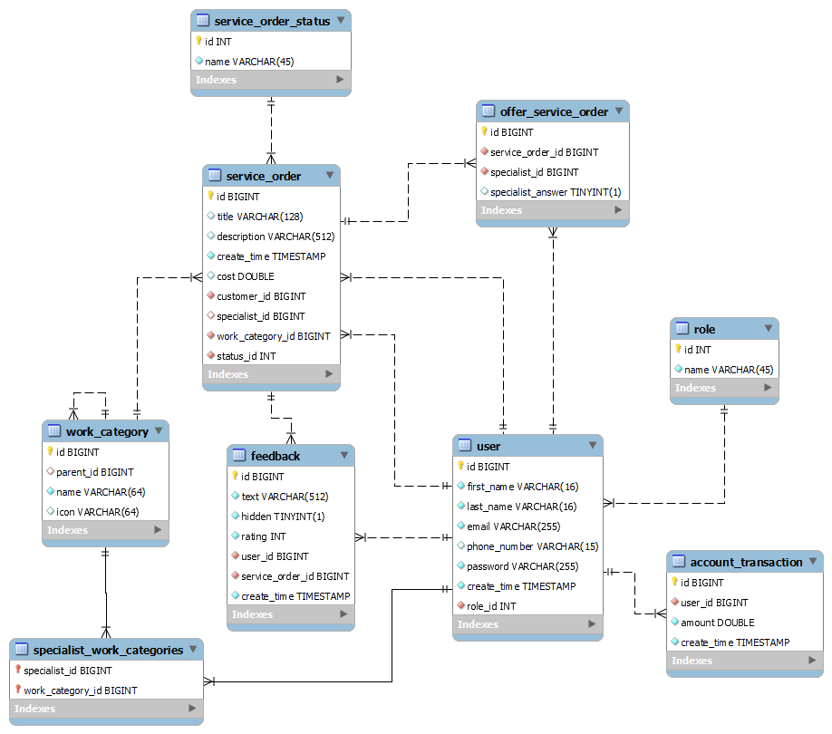

# Provide and Order Services

'Provide and Order Services' is a website designed to place orders about the need to provide certain services and to organize the interaction with specialists who wish to complete those orders

## Tools and Technologies:

* **Patterns**: MVC, Singleton, Controller, Dependency Injection/Inversion of Control
* **Back-end**: Spring Framework (Web, Security, Data)
* **Front-end**: HTML, CSS, Bootstrap4
* **Database**: Postgresql
* **Libraries**: Thymeleaf, jQuery

## Features by Users role:

* **Common**
    * Authorization and Authentication
    * View Work Categories
* **Admin**
    * Manage users
* **Customer**
    * Create Service Order
    * Manage Account (top-up, view transactions history, pay for Service Order, view Feadbacks about Customer with Average Rating)
    * Leave Feedback and Rating to the Specialist about Service Order
    * View created Service Order details, Customer and Specialist profiles
    * Send Offers to Specialist about Service Orders
    * Manage Service Orders completing
    * View created Service Orders and Feedbacks lists
    * Edit own User data
* **Specialist**
    * Manage Account (top-up, view transactions history, view Feadbacks about Specialist with Average Rating)
    * View Service Order details, Customer and Specialist profiles
    * View Service Orders and Feedbacks lists
    * Manage received Offers from Customers about Service Orders
    * Edit own User data

## Building & Running the Project:

1. Open pgAdmin in your workspace and initialize database from `db-sripts/postgresql-init.sql`
3. Clone the project into IDE on your local machine
4. Check database credentials in `src/main/resources/application.properties` and change username or password if needed
5. Run the Spring Web Application.

## Entity Relationship Diagram

